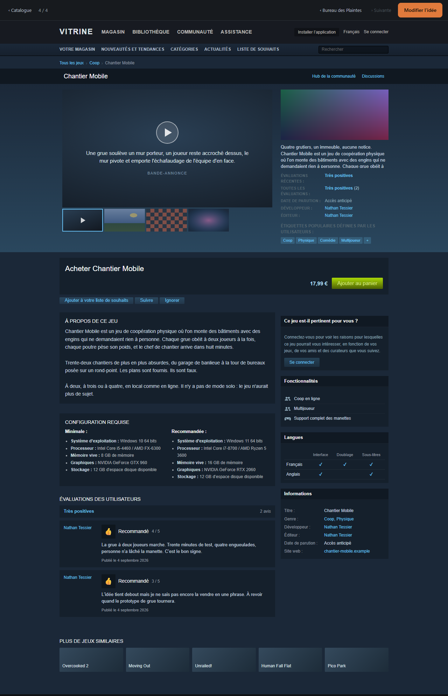

# Lot 3b — La vraie vitrine : réplique fidèle d'une page store

> La capture ci-dessus est la page réelle, prise sur l'instance de démonstration
> du lot. Une idée de test (« Chantier Mobile »), une capsule, trois captures,
> deux verdicts, cinq concurrents. Tout ce qu'on y lit vient de la fiche.

Le lot 3 avait livré une vue qui empruntait la *structure* d'une fiche de
magasin sans ses couleurs — c'était le cadrage, et c'était le mauvais. Une page
qui ressemble à un résumé de fiche ne déclenche pas le réflexe qu'on cherche.
Ce lot la refait entièrement en photomontage : mêmes proportions, mêmes
couleurs, mêmes composants, seules les données changent.

Tout le reste du lot 3 — corbeille, purge, tokens, catalogue, passe de DA — est
resté tel quel.

---

## 1. Ce qui est livré

### La page store, refaite de zéro

`/idees/:slug/steam` est maintenant une réplique d'une page de jeu sur un store
de bureau, en français. De haut en bas :

| Bloc | Contenu |
|---|---|
| Barre de navigation globale | Fond `#171a21`, « Vitrine » à la place du logo, menus inertes (Magasin, Bibliothèque, Communauté, Assistance), et à droite installation / langue / connexion. |
| Sous-barre du magasin | Votre magasin, Nouveautés et tendances, Catégories, Actualités, Liste de souhaits, plus un champ de recherche. Inerte. |
| Fil d'Ariane | « Tous les jeux › [étiquette de tête] › [Titre] ». |
| Barre du jeu | Bandeau sombre pleine page : le titre à gauche, « Hub de la communauté » et « Discussions » à droite. |
| En-tête | Dégradé `#1b2838 → #2a475e`, visionneuse 600 × 337 à gauche, colonne d'un coup d'œil 324 à droite. |
| Bloc d'achat | « Acheter [Titre] », prix, bouton vert « Ajouter au panier » (inerte). |
| Rangée d'actions | « Ajouter à votre liste de souhaits » (**actif**), « Suivre », « Ignorer ». |
| Colonne principale | À propos de ce jeu, Configuration requise, Évaluations des utilisateurs. |
| Colonne droite (308) | Pertinence, Fonctionnalités, Langues, Informations. |
| Bas de page | « Plus de jeux similaires ». |

**Géométrie** : contenu sur 940 px, en-tête en 616 + 324, corps en 616 + 308
avec 16 px de gouttière, visionneuse 600 × 337, capsule au format 460 × 215
(rendue à 308 × 144, la largeur de la colonne). Les barres du haut et le
bandeau d'en-tête sont pleine page ; seul le contenu est ramené à 940.

**Aucune marque** : pas de logo, pas de wordmark emprunté, le mot « Steam »
n'apparaît nulle part dans la page ni dans le code de la page. La police est
déclarée `"Motiva Sans", Arial, Helvetica, sans-serif` : installée chez Nathan
elle s'applique, sinon Arial donne le même gabarit.

**La visionneuse** : le premier élément est toujours la bande-annonce — une
carte sombre, un bouton lecture, le texte du champ `gif` en sous-titre — puis
les images attachées (capsule exclue) comme captures. Bandeau de vignettes
116 × 65 en dessous, vignette active surlignée, flèches superposées aux bords
et masquées quand il n'y a rien à faire défiler. Un clic sur une capture ouvre
la visionneuse plein écran du lot 2.

### Correspondance des données

| Store | Donnée |
|---|---|
| Titre | `title` |
| Courte description | `tagline` puis `pitch`, tronqués |
| À propos de ce jeu | `pitch` en entier |
| Bande-annonce | `gif` |
| Captures | pièces `image` hors capsule, dans l'ordre |
| Prix | `price_cents` (« Gratuit » à zéro ou nul) |
| Étiquettes / Genre | `family` traduite (table `STORE_TAGS`) |
| Date de parution | `status` : idée / réserve / pause / abandonné → « À venir » ; prototype / en cours → « Accès anticipé » ; publié → `updated_at` |
| Évaluations | score du verdict courant : 5 → « Extrêmement positives » … 0 → « Négatives » ; aucun verdict → « Pas encore d'évaluation ». Nombre d'avis = nombre de verdicts |
| Avis | les trois verdicts les plus récents : note, score, date, « Recommandé » à partir de 3 / 5 |
| Développeur / Éditeur | `DEVELOPER_NAME` (défaut « Nathan ») |
| Site web | domaine de la première pièce jointe de type lien |
| Jeux similaires | `competition`, découpé sur `,` `;` et les retours à la ligne |

### La liste de souhaits — le seul bouton actif

- Migration `003-wishlist.sql` : `ideas.wishlisted_at` (datetime nullable) et
  son index.
- `PATCH /api/ideas/:slug` accepte `wishlisted` booléen ; l'API sert
  `wishlisted_at` partout où elle sert une idée (fiche, catalogue, corbeille).
- `GET /api/ideas?wishlisted=true|false` filtre le catalogue.
- Le bouton « Ajouter à votre liste de souhaits » bascule l'état, devient
  « ✔ Sur votre liste de souhaits » en vert, et persiste.
- Catalogue : une case « Liste de souhaits » dans la barre de filtres, et un
  marqueur « ✔ SOUHAITÉE » discret sur la capsule des cartes concernées.

### Ce qui reste du lot 3

- La navigation précédente / suivante respecte toujours les filtres du
  catalogue, mais elle a déménagé dans une fine barre de service collante
  au-dessus de la maquette, avec « Modifier l'idée ». La bannière « Maquette »
  a disparu de la page : la barre suffit à dire ce qu'on regarde.
- La visionneuse plein écran du lot 2 reste branchée sur les captures.
- Mobile : la page reste celle de bureau. Elle s'éloigne par paliers (`zoom`
  0,8 / 0,62 / 0,45) et se fait défiler horizontalement. Pas de version mobile.

### Configuration

`DEVELOPER_NAME` (défaut `Nathan`), documentée dans `.env.example`, servie au
front par `GET /api/config`.

---

## 2. Les choix faits

**Un module partagé plutôt qu'une duplication.** La traduction « idée » →
« fiche de magasin » (étiquettes, date de parution, libellé d'évaluation, prix,
concurrents) vit dans `shared/store-model.js`, du JavaScript pur sans
dépendance, avec ses types à côté dans `store-model.d.ts`. Le front l'importe,
les tests `node:test` du serveur l'exécutent tel quel. C'était la seule manière
de tenir la demande de tests sans écrire deux fois la même table, une fois en
TypeScript pour la page et une fois en JavaScript pour le test — et deux tables
finissent toujours par diverger. Le prix payé : un troisième dossier à la
racine et un `fs.allow` explicite dans la configuration Vite.

**`steam.css` est hors de `tokens.css`, et c'est assumé.** La règle du projet
veut que toute la DA tienne dans les tokens. Ce photomontage n'est pas de la DA
Vitrine : c'est l'imitation d'une autre. Ses couleurs sont déclarées sous
`.sp-mock`, ne sortent jamais de là, et aucun token n'y entre. La règle est
maintenue partout ailleurs ; l'exception est écrite dans `CLAUDE.md` pour
qu'elle ne se propage pas par contagion.

**`wishlisted_at` est une date, pas un booléen.** Savoir *quand* Nathan a eu le
réflexe vaut plus que savoir qu'il l'a eu. Rien ne l'exploite encore ; c'est
gratuit à stocker et impossible à reconstruire après coup.

**Mettre en liste de souhaits ne touche pas `updated_at`.** Un patch qui ne
porte que `wishlisted` laisse la date de modification tranquille : sans cela, le
catalogue trié par mise à jour se réordonnerait sous la souris à chaque clic
dans la vue store, et la date de parution d'une idée publiée bougerait pour une
raison qui n'a rien à voir. Un test le vérifie.

**`DEVELOPER_NAME` passe par l'API, pas par une variable de build.** Le
conteneur se construit une fois et se configure par son environnement, comme le
reste du projet. Le coût est un appel de plus au chargement de la page ; son
échec est sans conséquence, le défaut « Nathan » s'affiche.

**La configuration requise est générique et figée.** Vitrine ne sait rien de la
configuration d'une idée. Une fiche de magasin sans ce tableau se remarque
beaucoup plus qu'une fiche avec un tableau approximatif — et personne ne lit ce
bloc, c'est précisément pour cela qu'il doit être là.

**Les statuts `pause` et `abandonne` affichent « À venir ».** Ce sont des états
de l'atelier, pas du magasin. Aucun magasin ne dit qu'un jeu est abandonné ; il
dit qu'il n'est pas encore sorti. C'est une décision de traduction, pas un
oubli — la table est explicite dans `RELEASE_KIND`.

**On pourrait le regretter :** le nom d'auteur des avis est le même sur les
trois cartes (c'est le développeur), ce qui casse un peu l'illusion quand une
idée a plusieurs verdicts. Fabriquer des pseudonymes serait inventer des
données ; afficher le vrai auteur est honnête et raconte ce que c'est. À
arbitrer si ça gêne.

---

## 3. Dépendances ajoutées

**Aucune.** Le lot n'installe rien : ni police, ni bibliothèque de carrousel, ni
utilitaire de dates. Les pictogrammes de la colonne « Fonctionnalités » sont des
SVG écrits dans le composant, le bandeau de vignettes est une `translateX`, les
dates passent par `Intl`.

---

## 4. Points laissés ouverts

1. **La police.** Sans « Motiva Sans » installée, Arial prend le relais : le
   gabarit est le bon, le dessin des lettres non. Si Nathan veut se rapprocher
   encore, l'installer localement suffit, rien à changer dans le code.
2. **Le nom d'auteur des avis** (voir plus haut).
3. **La date de parution d'une idée publiée** est `updated_at`, faute de mieux.
   Un champ `released_at` réglerait le sujet proprement le jour où une idée sera
   vraiment publiée.
4. **Le bloc « Langues »** est figé sur Français / Anglais. Ça ne se pilote pas
   par les données aujourd'hui, et rien ne demande que ça le devienne.
5. **La liste de souhaits n'a pas de tri dédié** au catalogue : on peut la
   filtrer, pas trier par date de mise en liste. `wishlisted_at` est en base si
   le besoin arrive.
6. **Le compte d'avis** est le nombre de verdicts — donc « 2 avis » là où un vrai
   magasin en afficherait des milliers. C'est vrai plutôt que crédible ;
   inventer un multiplicateur serait mentir sur le seul chiffre que Nathan
   connaît.

---

## 5. Checklist de vérification manuelle

Lancer `npm run dev`, ouvrir `http://localhost:5173`.

**La page**

- [ ] Ouvrir une idée avec capsule, captures, verdicts, prix et concurrence, puis
      « Voir la page » depuis le catalogue.
- [ ] Mettre la capture d'écran de cette page à côté d'une vraie page de store :
      hésiter.
- [ ] Vérifier que le mot « Steam » n'apparaît nulle part dans la page, ni logo,
      ni wordmark.
- [ ] Cliquer les menus du haut, « Ajouter au panier », « Suivre », « Ignorer »,
      « Se connecter » : rien ne se passe, rien ne navigue.
- [ ] Cliquer les vignettes : la visionneuse change, la vignette active se
      surligne. Cliquer la capture affichée : la visionneuse plein écran s'ouvre,
      Échap ferme.
- [ ] Une idée sans capsule : le placeholder gris occupe la même place, la page
      ne bouge pas d'un pixel par rapport à une idée avec capsule.
- [ ] Une idée sans `gif` : la carte bande-annonce le dit sans casser la mise en
      page.
- [ ] Une idée sans verdict : « Pas encore d'évaluation » partout, et une carte
      d'avis vide plutôt qu'un trou.
- [ ] Une idée sans concurrence : la ligne le dit, la section reste.

**La liste de souhaits**

- [ ] Cliquer « Ajouter à votre liste de souhaits » : le bouton passe au vert
      avec la coche.
- [ ] Recharger la page (F5) : il est toujours vert.
- [ ] Revenir au catalogue : la carte porte le marqueur « SOUHAITÉE ».
- [ ] Cocher le filtre « Liste de souhaits » : seule cette idée reste. Décocher :
      tout revient.
- [ ] Trier le catalogue par « Mise à jour », noter la position de l'idée, la
      dé-wishlister puis la re-wishlister depuis sa page store, revenir : elle
      n'a pas changé de place.
- [ ] Recliquer le bouton : il redevient bleu, le marqueur disparaît du
      catalogue.

**La navigation**

- [ ] Depuis un catalogue filtré, ouvrir une page store : la barre du haut
      annonce « n / total » et « Suivante » suit la liste filtrée, pas le
      catalogue entier.
- [ ] « Modifier l'idée » ramène à la fiche éditable.
- [ ] Le lien « Catalogue » revient au catalogue avec ses filtres.

**Le reste**

- [ ] Réduire la fenêtre : la page s'éloigne au lieu de se casser, et se fait
      défiler horizontalement en dessous.
- [ ] `npm test` : tout passe.
- [ ] `docker compose up --build` : la page est identique en production.
- [ ] Définir `DEVELOPER_NAME=Autre chose` dans `.env`, redémarrer : les lignes
      Développeur et Éditeur suivent.

---

## 6. Tests ajoutés

`server/test/wishlist.test.js` — bascule dans les deux sens, persistance sur
`GET`, `wishlisted_at` servi par le catalogue, filtre dans les deux sens, refus
d'une valeur non booléenne, `updated_at` préservé sur un patch wishlist seul, et
`GET /api/config`.

`server/test/store-model.test.js` — chaque famille du seed a au moins deux
étiquettes distinctes et non vides, la table ne couvre que les familles du seed,
une famille inconnue retombe sur un repli ; chaque statut a une date de parution
et chacune est vérifiée nommément ; chaque score a son libellé d'évaluation et
sa teinte, l'absence de verdict aussi ; le seuil de recommandation, le support
manette présent sur toutes les familles, le prix gratuit, le découpage de la
concurrence et la troncature de la courte description.

Total : **95 tests, tous verts.**
